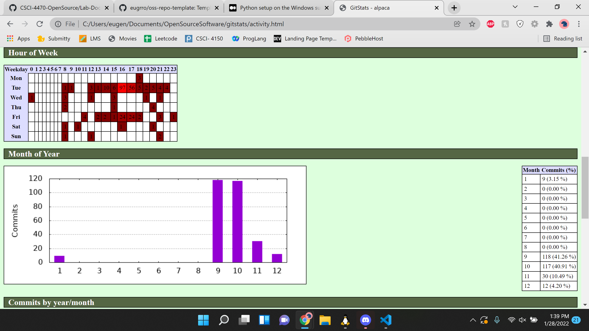

# Lab 02 Report - Documentation and Community Development 
## Part 1
https://github.com/eugrro/oss-repo-template/wiki/Some-project-ideas
## Alpaca project https://github.com/rpi-alpaca/alpaca
* There are **15** contributors
* There are **7205** lines of code
* The first commit was called **initial commit** on **September 12, 2019**
* The latest commit was called **update AlpacaLogoProto1.png to be PascalCase for consistency in file naming** on **January 28, 2020**
* The current branches are: master, color_test and LogicGate
  
There are some differences in the values