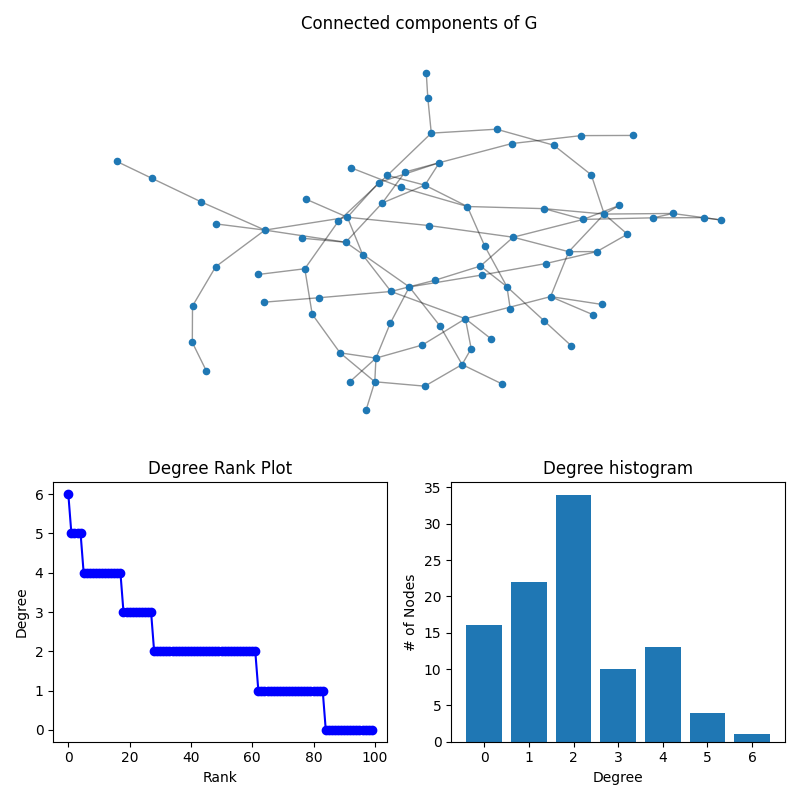
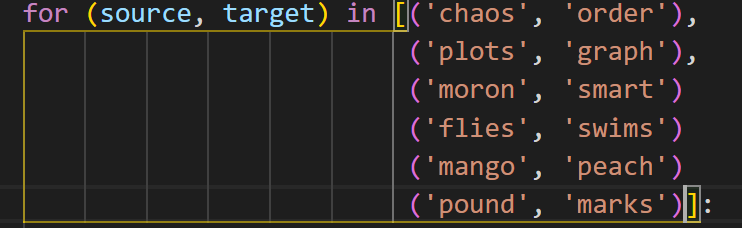
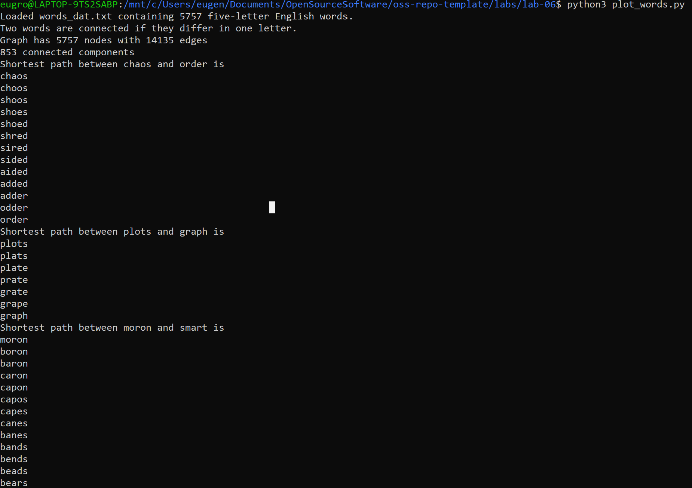
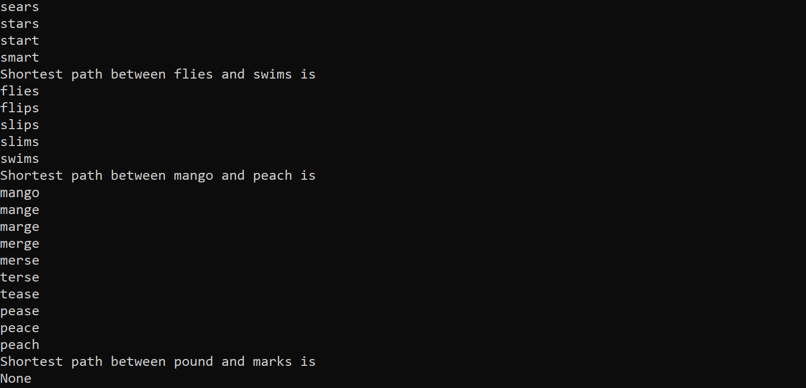
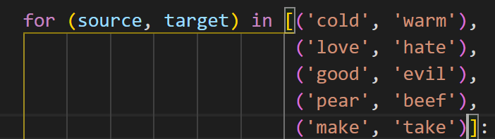
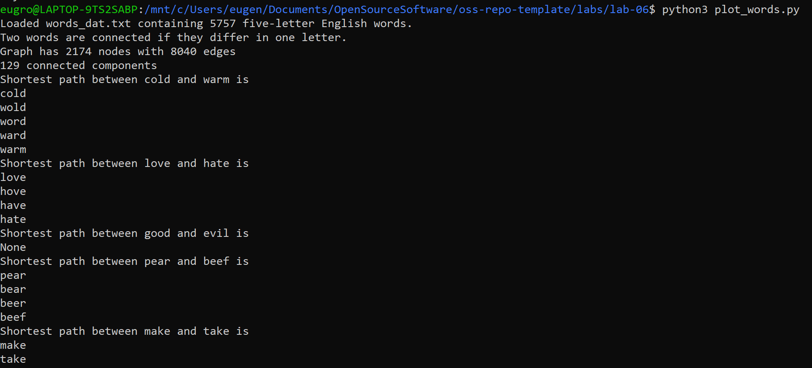
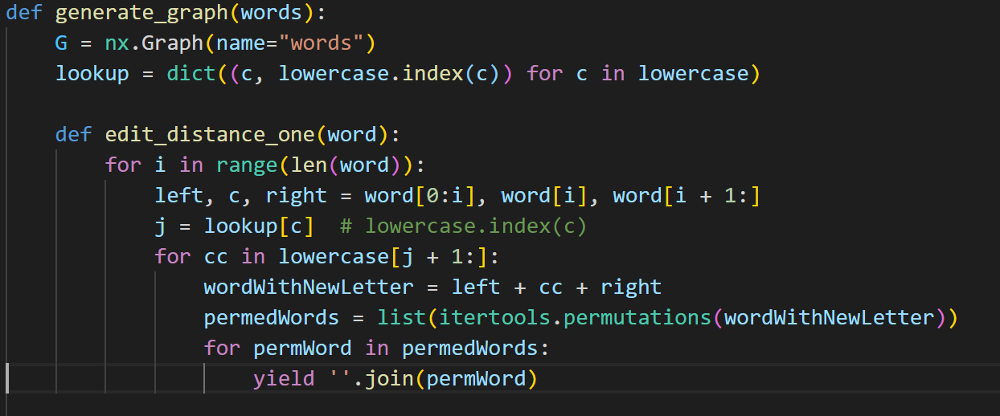
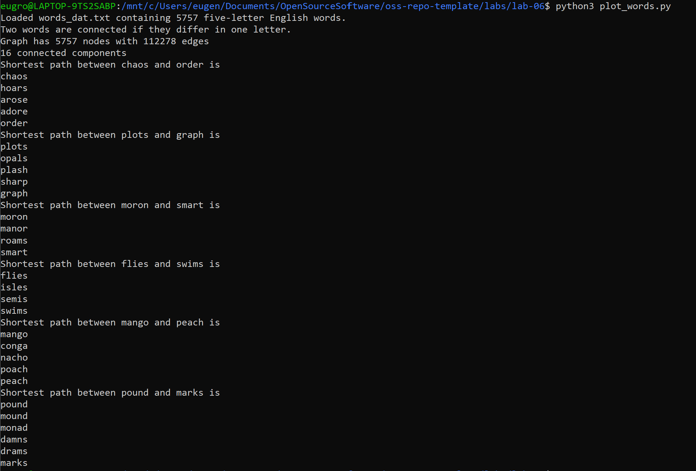

# Lab 06 Report - Scientific Computation

## 1) Length 5 words new paths

## 2) Length 4 words new paths

Also changed the file and the number of chars used

## 2) Length 5 words with permutations

