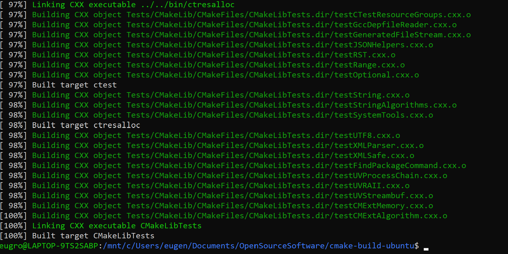
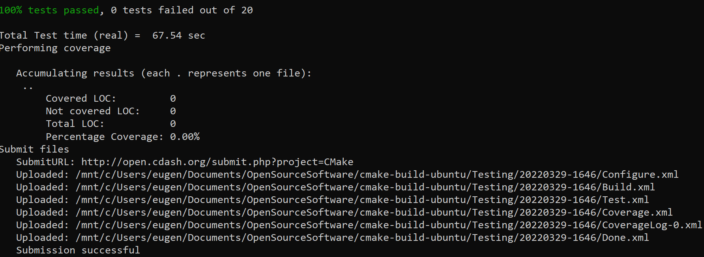
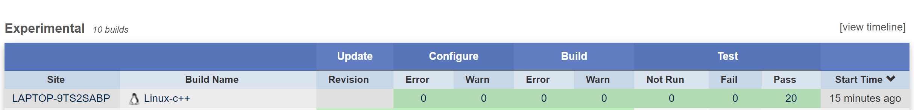
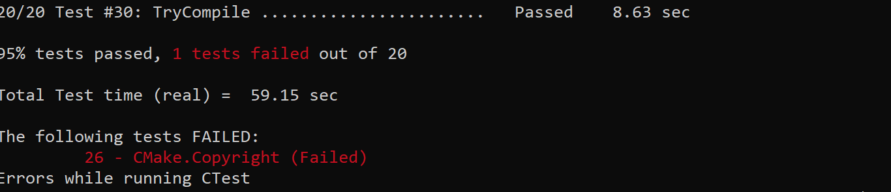
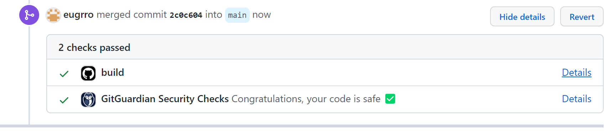
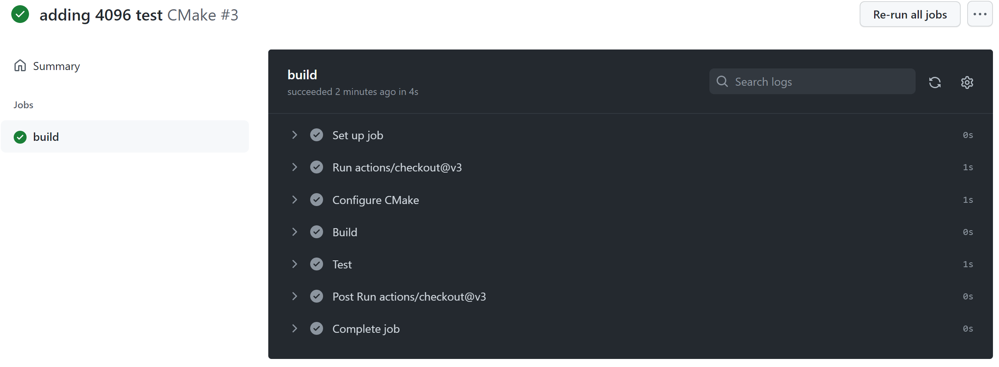
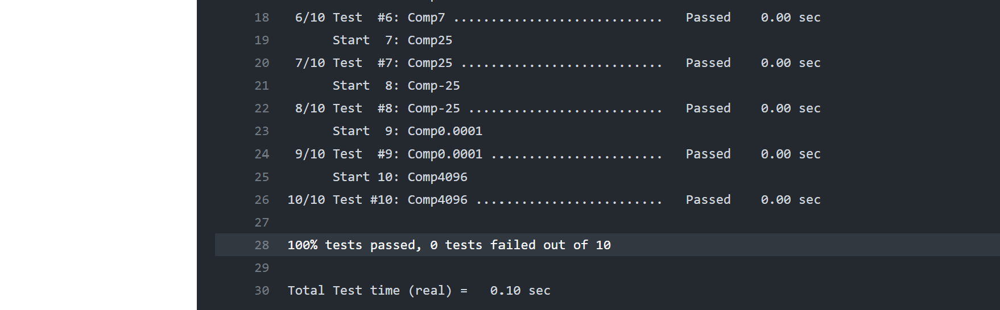

# Lab 08 Report - Testing and Continuous Integration
I had many issues getting cmake to run on windows (Issue was somehow my WSL and Windows configs got mixed up and was incorrectly building) and needed both the TA's help and Professor Turner to get it fixed. That is why this is a few days late
## Checkpoint 1

## Checkpoint 2
* Find the Nightly and Experimental sections and look at some of the submissions. How can you see what tests were run for a particular submission?  
You can click on the build name which will take you to the build page. Once there you can select Dashboard->Tests and it will list all of tests for that build

* Find a submission with errors. Can you see what the error condition was? How does this help you debug the failure?  
The cmake-windows_vs2022_x64 had an error. Delving a little deeper, I found that The issue was called RunCMake.add_test which the system said was "unstable". Delving even deeper I could see the issue was when it was validating special characters ValidSpecialChars. Seeing the output will greatly help in debugging the issues since it was running nightly

* Find a system that is close to your specific configuration in the Nightly, Nightly Expected or one of the Masters sections. How clean is the dashboard? Are there any errors that you need to be concerned with?
I think that the nightly-cmake-windows_clang13.0_gnu_ninja is the closest to my specific system. There were not issues and it was compiled 4 hours ago

## Checkpoint 3

## Checkpoint 4

