# Lab 9: Databases

## Checkpoint 0: Project Updates
During early March, the node IPC module was intentionally broken for devices with an IP address in Belarus or Russia. These changes come with potentially serious consequences. Since most of large scale open source source content is developed in the US or western countries, this may cause less companies to use these open source contributions to lose the dependencies on outside actors. A large company thats just looking for consistent software might now choose to create custom code for everthing, losing trust in the open source communities. While I think the actions of these changes are honorable, it may cause fewer people to utilize free pacakages in favor of mitigating risk 
## Checkpoint 1: Install CouchDB
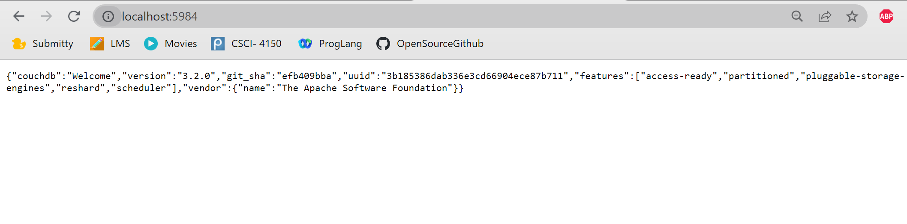
## Checkpoint 2: Quick Tour
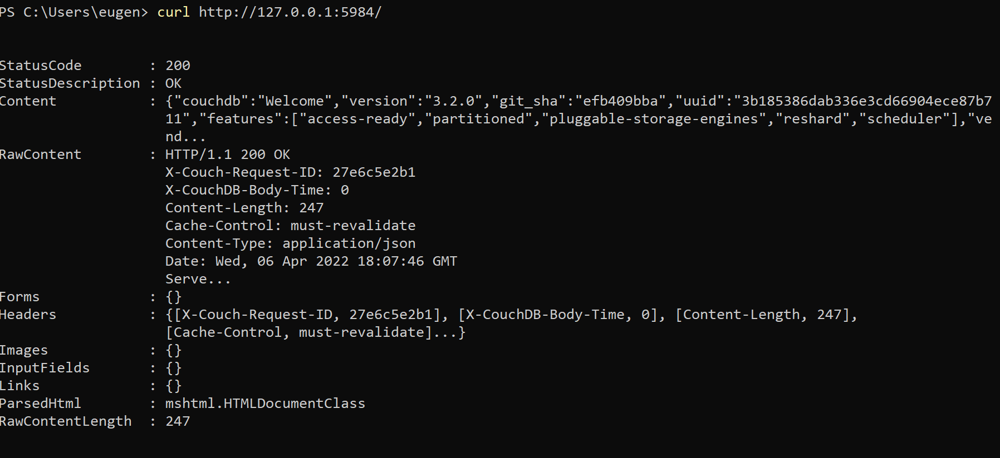
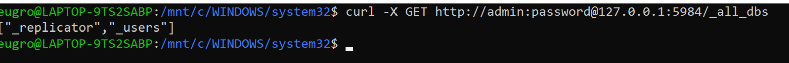
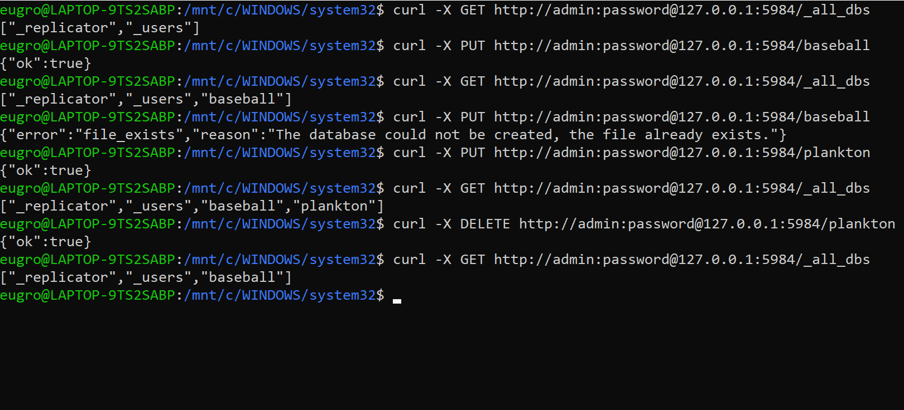
## Checkpoint 3: Now Complete the API Tutorial
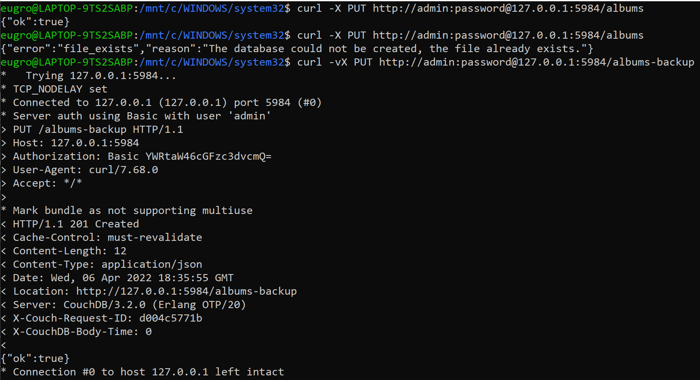
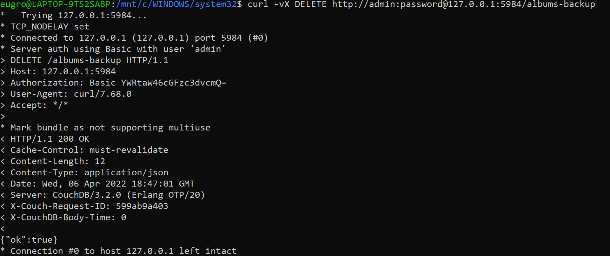
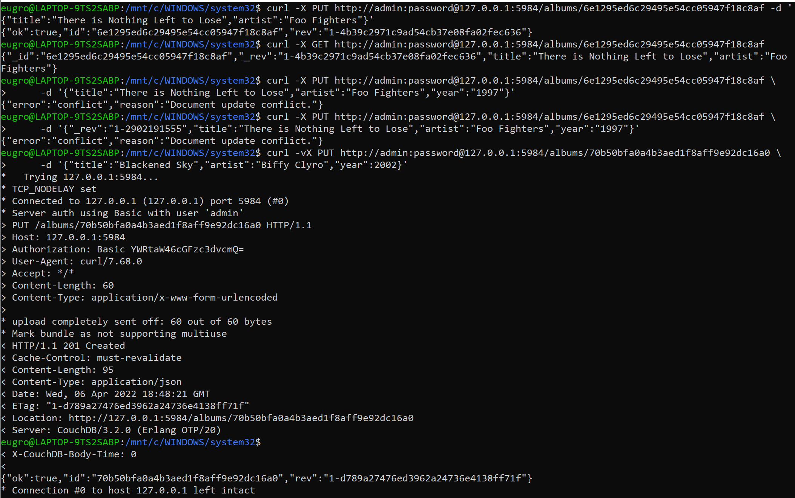
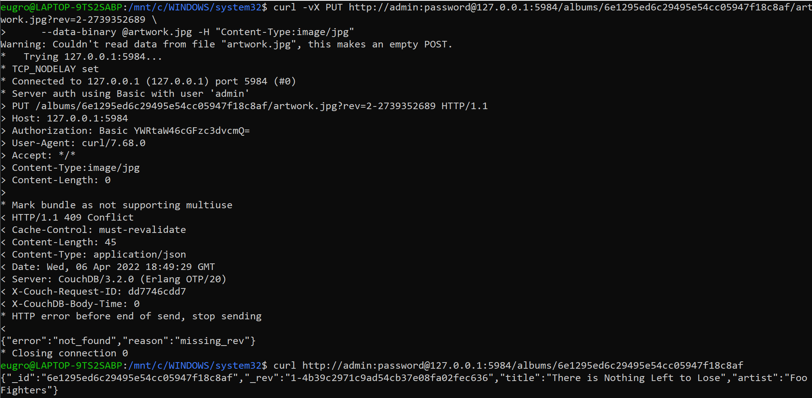
## Checkpoint 4: What Did We Miss?
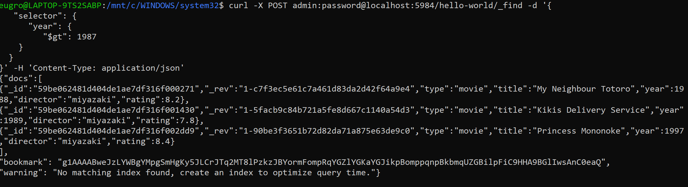
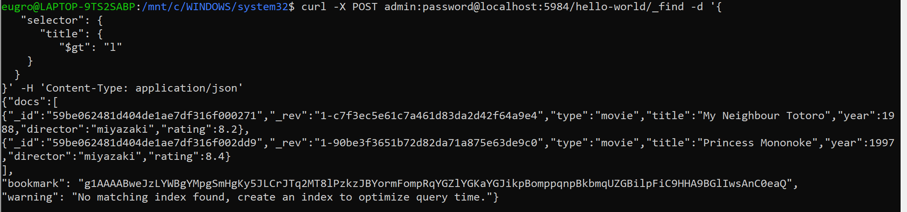
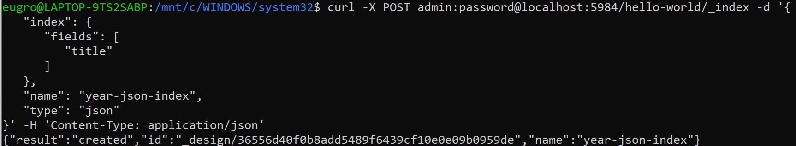
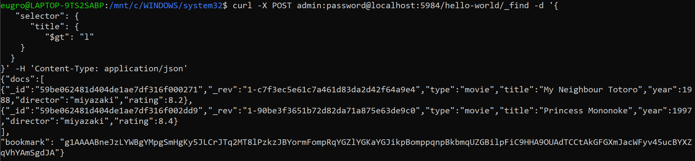